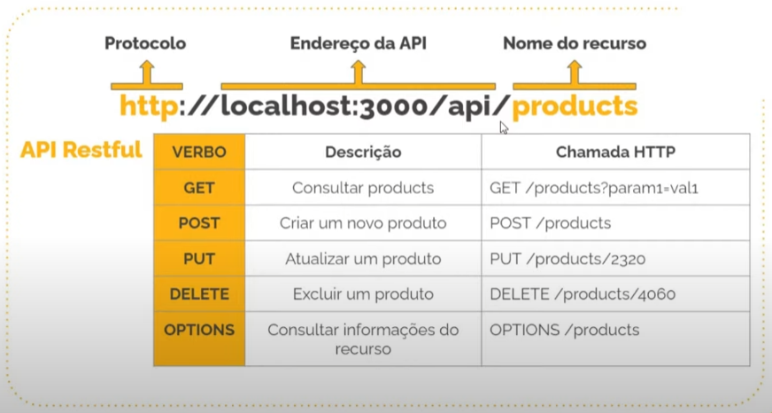

# Desenvolvimento de APIs com Nest.js

### O que é Nest.js

* Framework com arquitetura MVC
* Fullstack = TypeScript + Angular

 

* DOCS: [CLIQUE AQUI](https://docs.nestjs.com/)

### Vantagens

* COC (Convention Over Configuration) = nome de arquivo, nome de pastas, etc
* TypeScript
* Arquitetura escalar (baseado no Angular)
* Integração fácil com vários tipos de bancos de dados
* Suporte a microsserviço
* Suporte a criação de API Rest
* Suporte a GraphQL

### O que o Nest.js não é?

* Angular
* React
* Vue

### Ciladas ao usar o Nest.js

* 1º aprender a base do JavaScript
* Não depender apenas de framework

### API Rest

* API = Application Program Interface
* Rest = Representational State Transfer

* Convesões
    * Retorno da API sempre em JSON (JavaScript Object Notation)
    * URL da API
        

* Importância
    * Comunicação pode ser feita por qualquer maneira